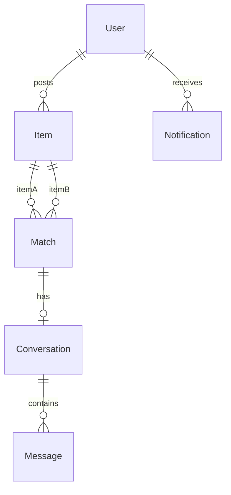

# Database Schema

## User

- `email`, `passwordHash`, `role`, `emailVerified`
- `emailVerifyToken`, `resetPasswordToken`, `otpCode`
- `banned`, `banReason`, `lastActiveAt`

## Item

- `title`, `description`, `category`, `location`, `locationAddress`
- `locationGeo` (GeoJSON Point), `date`, `imageUrl`, `type`, `status`
- `textEmbedding[]`, `imageEmbedding[]` (not selected by default)
- `flagged`, `flagReason`

**Indexes:** text search, `2dsphere` on `locationGeo`, compound on status/type

## Match

- `itemA`, `itemB`, `score`, `scoreBreakdown`, `initiatorItem`, `status`
- `claim` subdocument (requested/approved/rejected)

## Conversation, Message, Notification, AuditLog

See `server/models/`.

