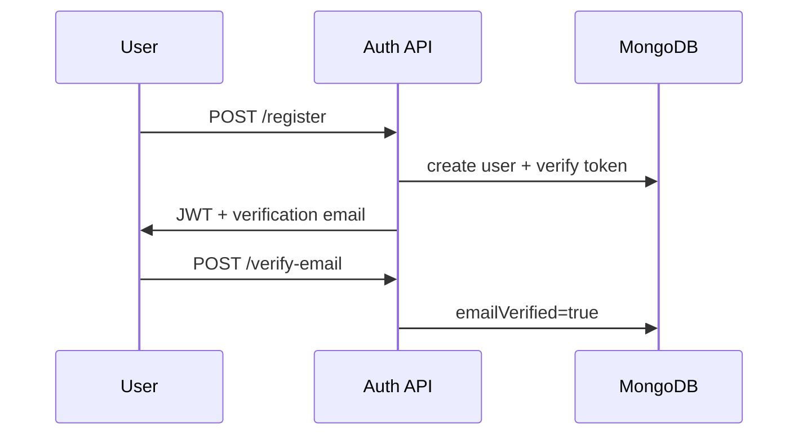
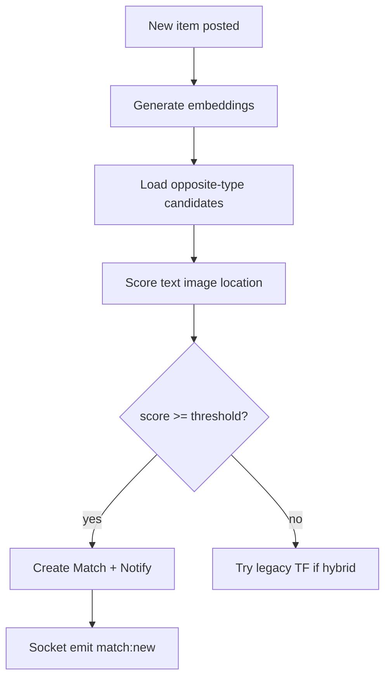
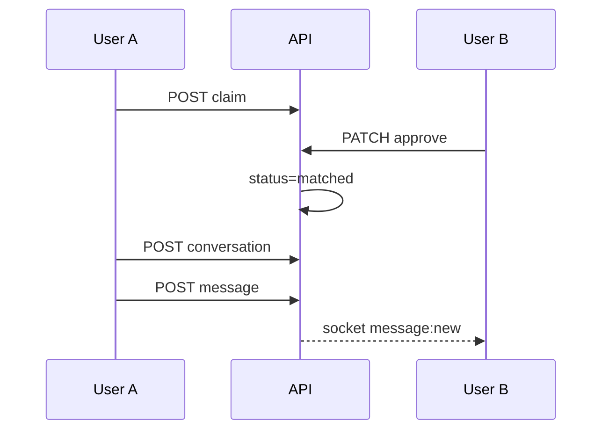

# Flow Diagrams

## Auth flow

```mermaid
sequenceDiagram
  participant U as User
  participant API as Auth API
  participant DB as MongoDB
  U->>API: POST /register
  API->>DB: create user + verify token
  API->>U: JWT + verification email
  U->>API: POST /verify-email
  API->>DB: emailVerified=true
```

## Matching flow

```mermaid
flowchart TD
  A[New item posted] --> B[Generate embeddings]
  B --> C[Load opposite-type candidates]
  C --> D[Score text image location]
  D --> E{score >= threshold?}
  E -->|yes| F[Create Match + Notify]
  E -->|no| G[Try legacy TF if hybrid]
  F --> H[Socket emit match:new]
```

## Claim + chat

```mermaid
sequenceDiagram
  participant A as User A
  participant API
  participant B as User B
  A->>API: POST claim
  B->>API: PATCH approve
  API->>API: status=matched
  A->>API: POST conversation
  A->>API: POST message
  API-->>B: socket message:new
```
